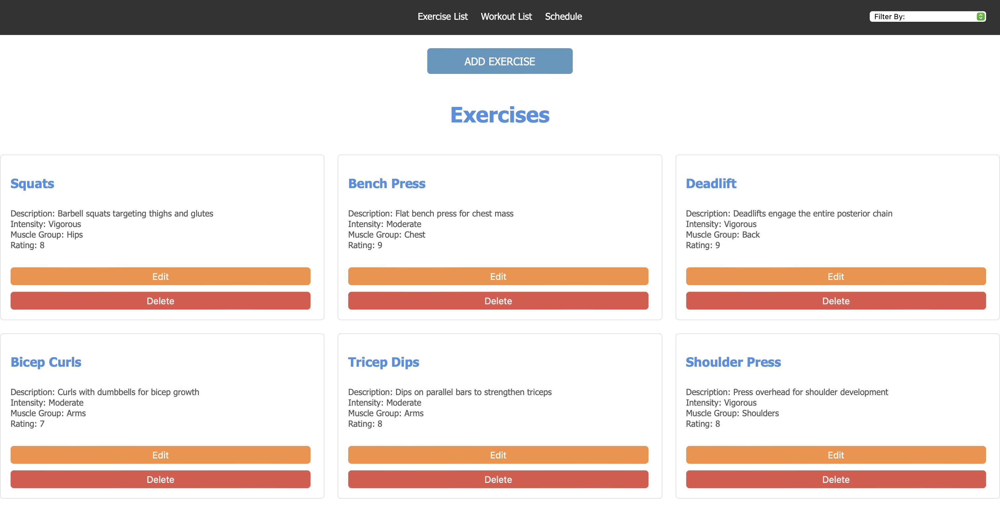
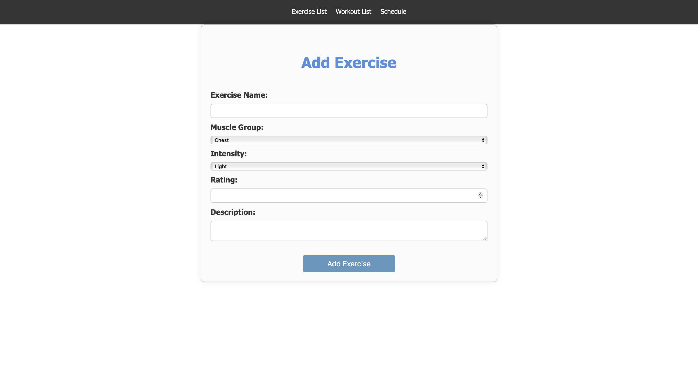
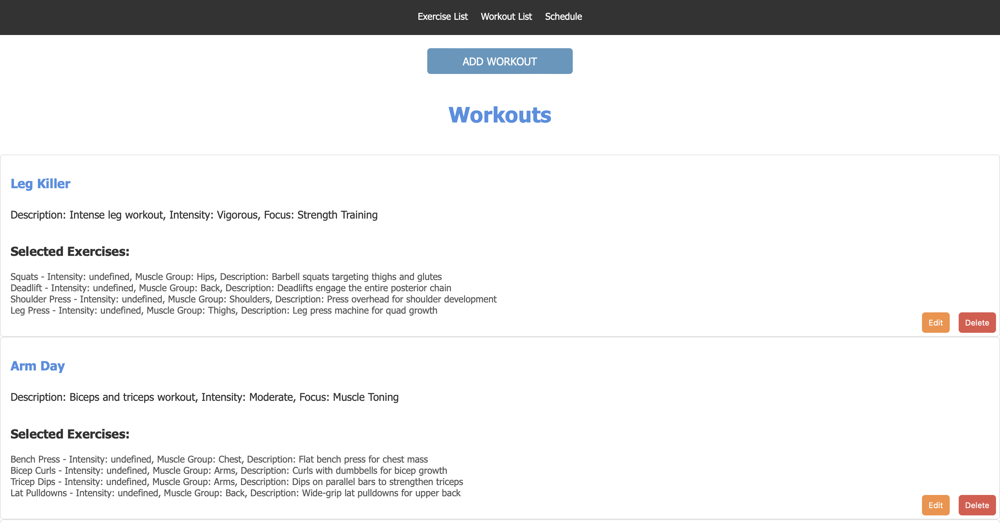
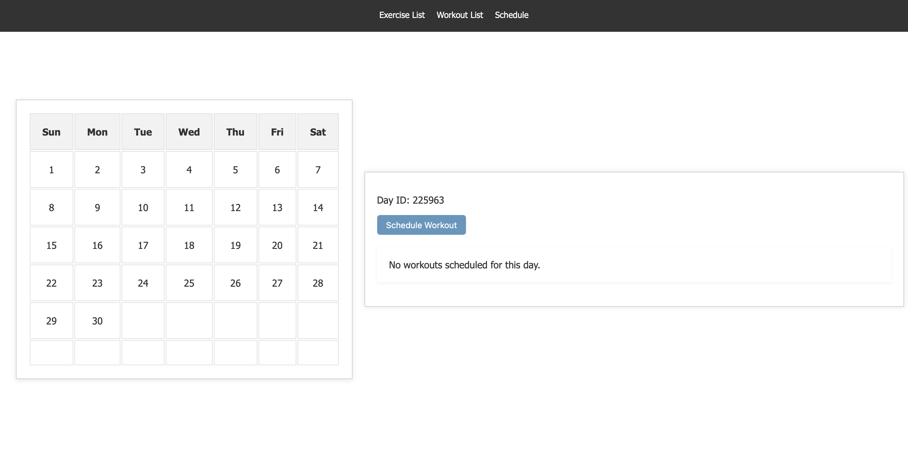

# WorkoutDatabase

## Overview

This project is a web application built using Flask, a lightweight WSGI web framework for Python. The application showcases the following features:

- Dynamic content generation using Flask and Jinja2 templating.
- Data management and persistence with Flask-SQLAlchemy and PostgreSQL.
- User-friendly UI designed with HTML, CSS, and JavaScript.
- Secure handling of data and sessions using secure cookies and HTTPS protocols.
- Comprehensive error handling and logging for debugging and maintenance.

## Screenshots

Here are some screenshots that demonstrate the functionality and user interface of the application:

1. **Exercise List**  
   

2. **Data Entry Form**  
   

3. **Workout List**  
   

4. **Schedule**  
   

## Technologies Used

The following technologies were used to develop this web application:

- **Python**: The core programming language used to develop the backend logic.
- **Flask**: A lightweight WSGI web framework for Python that simplifies the creation of web applications.
- **Flask-SQLAlchemy**: An extension for Flask that adds support for SQLAlchemy, a SQL toolkit and Object-Relational Mapping (ORM) system.
- **PostgreSQL**: A powerful, open-source object-relational database system used for data storage.
- **HTML/CSS/JavaScript**: Frontend technologies for creating a responsive and interactive user interface.
- **Jinja2**: A templating engine for Python used to generate dynamic HTML pages.
- **Werkzeug**: A comprehensive WSGI web application library used in conjunction with Flask.
- **SQLAlchemy**: The underlying ORM used for interacting with the PostgreSQL database.

## Installation

To run this project locally, follow these steps:

1. **Clone the repository**:

    ```bash
    git clone https://github.com/<yourusername>/WorkoutDatabase.git
    cd WorkoutDatabase
    ```

2. **Create a virtual environment**:

    ```bash
    python3 -m venv venv
    source venv/bin/activate
    ```

3. **Install the required packages**:

    ```bash
    pip install -r requirements.txt
    ```

4. **Run the application**:

    ```bash
    /bin/bash /path/to/WorkoutDatabase/run_flask.sh
    ```

5. **Visit the application**:

    Open a browser and go to `http://127.0.0.1:5000/` to see the app in action.